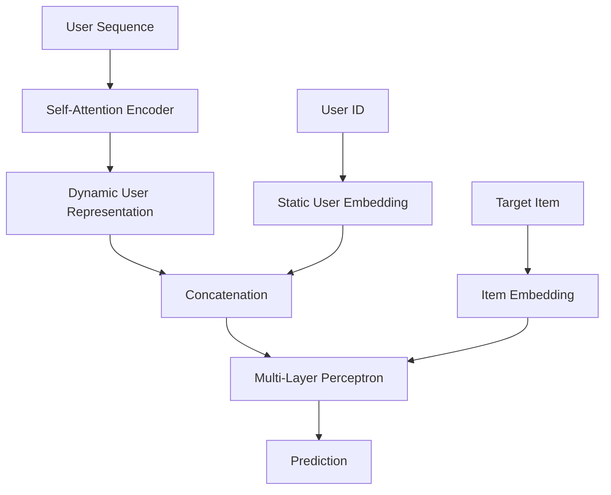

# MM-ShortVideo-Rec


## Abstract
A recommendation framework designed for short video platforms is introduced. The system utilizes a Transformer-based architecture to capture dynamic preferences of users and a neural matrix factorization component to model static interactions between users and items. The approach processes historical interaction sequences to improve recommendation accuracy.

## Methodology
The architecture, denoted as Sequential Neural Matrix Factorization or SeqNeuMF, integrates a sequential encoder with Neural Matrix Factorization. The sequence of historical user interactions is processed by a self-attention mechanism to generate a dynamic representation of the user. This dynamic representation is concatenated with a static embedding of the user. The combined features are passed through multi-layer perceptrons to predict the interaction probability with target items.



## Project Structure
The directory tree of the source code is presented below.

```text
MM-ShortVideo-Rec/
├── data/
│   └── microlens-5k/
├── src/
│   ├── data.py
│   ├── engine.py
│   ├── inference.py
│   ├── metrics.py
│   ├── mlp.py
│   ├── neumf.py
│   ├── seqneumf.py
│   └── train.py
├── utils/
│   └── download_data.py
├── pyproject.toml
└── README.md
```

## Environment and Setup
The environment is managed by the ``uv'' package manager. The dependencies are specified in the ``pyproject.toml'' and ``uv.lock'' files to ensure reproducibility. The environment setup is performed by the following commands.

```bash
uv venv
source .venv/bin/activate
uv sync
```

## Data Preparation
The MicroLens-5k dataset is utilized for empirical validation. The raw dataset is downloaded and extracted into the ``data/microlens-5k'' directory. The download process is automated by a utility script.

```bash
python utils/download_data.py
```

The input data must contain user interaction sequences. Data preprocessing is handled internally by the data loader module before being passed to the model.

## Usage
The pipeline is executed via the command line interface. The execution is separated into training and evaluation phases.

### Training
To train the SeqNeuMF model, the training script is executed.

```bash
python src/train.py
```

### Evaluation
To evaluate the trained model on the test set, the inference script is executed.

```bash
python src/inference.py
```
